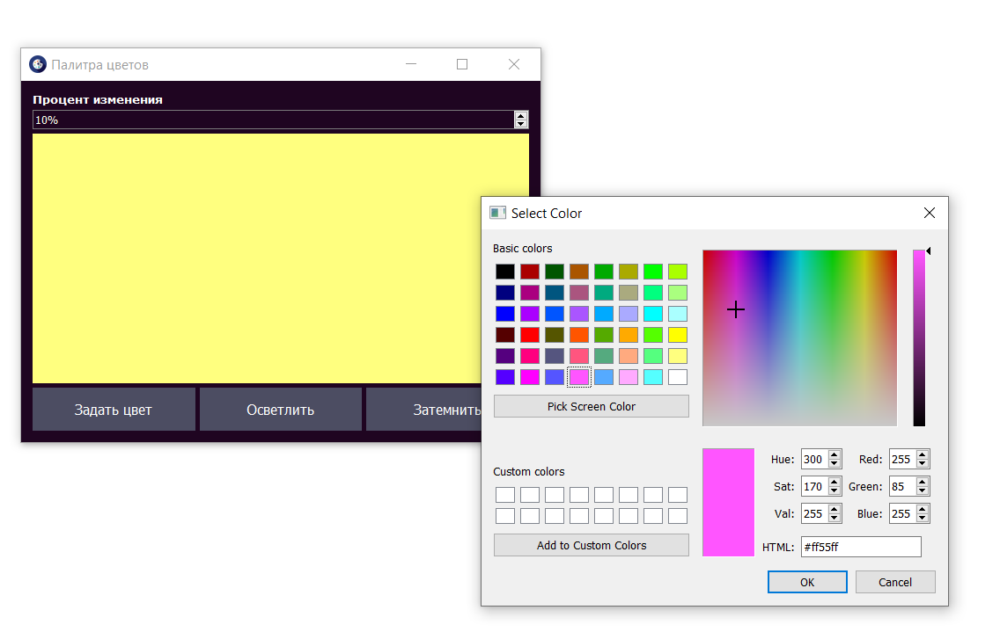

# 🎨 Палитра цветов 
## О программе
Данное приложение реализует графический интерфейс для работы с палитрой цветов.
Оно позволяет выбрать любой цвет из цветового спектра и произвести с ним 
простые манипуляции: осветлить или затемнить на определённый процент.

Код написан на языке python, для реализации графического интерфейса была 
использована библиотека PyQt5.

Интерфейс программы представлен на рисунке ниже.



## Реализация методов lighten и darken
Методы lighten и darken являются аналогами одноимённых функций, широко 
применяемых в Sass (метаязык на основе CSS). Подробнее об их реализации в Sass
можно прочитать в официальной документации: 
https://sass-lang.com/documentation/modules/color

В данной реализации методы lighten и darken принимают на вход значение процента
в диапазоне от 0 до 100. Они делают цвет темнее или светлее на заданный процент
относительно исходного цвета. Формула расчёта нового цвета следующая:
```python
colour += round(colour * percent / 100) * is_dark
```
Она несколько отличается для работы с белым цветом:
```python
new_colour = round(percent * 255 / 100)
```

## Запуск модульных тестов
Пакет содержит набор модульных тестов, написанных с использованием pytest 
и unittest. Для запуска тестов введите следующую команду внутри папки с 
проектом
```
python -m pytest
```

